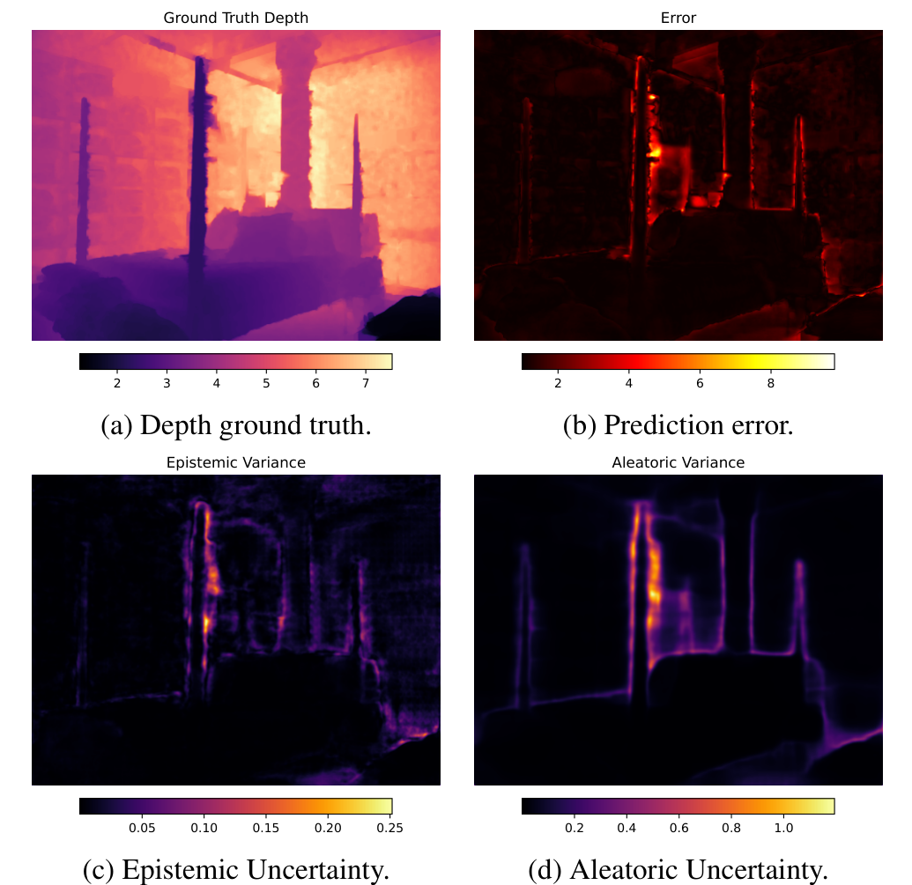
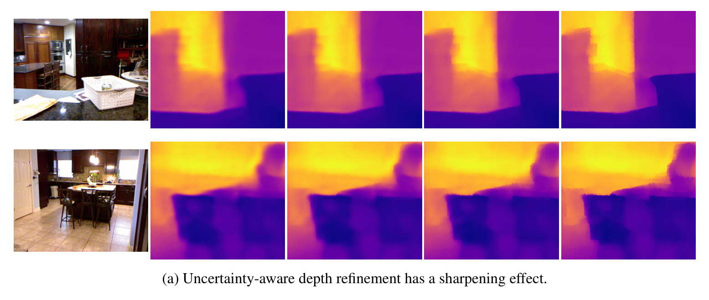
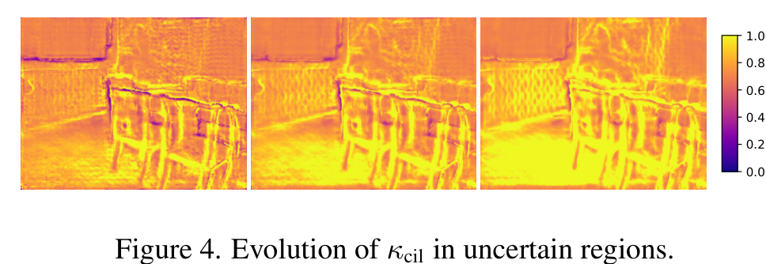

# Post-hoc Uncertainty-Aware Refinement for Monocular Depth Estimation

Monocular depth foundation models are strong in general, but they still go wrong in predictable places: occlusions, thin structures, and textureless regions. This project estimates *where* a pretrained depth model is likely to be wrong, then uses that uncertainty to refine the prediction, without retraining the base model from scratch.

Course project for the Computational Intelligence Lab (CIL), Department of Computer Science, ETH Zürich.

   
  <em>Estimated uncertainty lines up with where the prediction error actually is. Left to right: ground-truth depth, prediction error, and the epistemic and aleatoric uncertainty maps.</em>

## Idea

The method has two parts:

**1. Post-hoc uncertainty.** We take a pretrained depth model (DepthAnythingV2) and finetune a small deep ensemble of it to output a per-pixel Gaussian instead of a single depth value. Averaging over the ensemble gives a mean depth plus a variance, and that variance splits cleanly into two parts:
- *epistemic* uncertainty (model disagreement, reducible with more data), and
- *aleatoric* uncertainty (inherent noise in the scene).

Because this happens after the base model is trained, it adds calibrated uncertainty without hurting the original prediction.

**2. Uncertainty-guided refinement.** We borrow the idea of depth completion, where sparse trusted measurements are propagated to fix noisy predictions. Here the "trusted measurements" are simply the low-uncertainty pixels. A masked spatial-propagation network (MSPN) then spreads those confident values into the uncertain regions, and the update is combined with the previous estimate through a Kalman-filter step, where the uncertainty sets how large each correction should be.

## Results

**Uncertainty calibration.** We compare against the common image-flipping baseline using Area Under Sparsification Error (AUSE, lower is better) and Area Under Random Gain (AURG, higher is better). The ensemble localizes error far better, roughly 3× lower AUSE-L2:

| Method   | AUSE-L1 ↓ | AUSE-L2 ↓ | AURG-L1 ↑ | AURG-L2 ↑ |
|----------|-----------|-----------|-----------|-----------|
| Flipping | 0.0545    | 0.0265    | 0.0316    | 0.0302    |
| **Ours** | **0.0297**| **0.0082**| **0.0563**| **0.0486**|

**Depth accuracy.** The refinement runs on top of the finetuned ensemble. It sharpens edges qualitatively (below) and stays on par with the ensemble numerically, while both clearly beat the zero-shot foundation baselines:

| Method              | si-RMSE ↓ | AbsRel ↓ | RMSE ↓  | logRMSE ↓ | δ1 ↑   |
|---------------------|-----------|----------|---------|-----------|--------|
| DepthAnythingV2     | 0.565     | 0.357    | 1.076   | 0.375     | 0.416  |
| MiDaS               | 0.580     | 0.360    | 1.044   | 0.422     | 0.469  |
| Marigold            | 0.407     | 0.171    | 0.504   | 0.253     | 0.738  |
| SDR                 | 0.2718    | 0.0556   | 0.2837  | 0.0865    | 0.9653 |
| Ensemble (DA2)      | 0.2069    | 0.0487   | 0.2196  | 0.0698    | 0.9814 |
| **UDR (ours)**      | **0.2068**| **0.0479**| 0.2197 | **0.0696**| **0.9816** |

   
  <em>RGB input followed by the depth estimate across refinement iterations. Blurry, high-variance predictions get sharpened as confident values propagate inward.</em>

## Analysis

We track the Kalman gain over iterations. It starts high (trusting new measurements) and drops as predictions become confident, with the remaining correction concentrated in genuinely uncertain areas such as object edges.

   
  <em>Evolution of the (clipped inverse-log) Kalman gain. Bright means confident; the darker, low-gain regions sit at occlusions and edges.</em>

## Limitations

- The MSPN has a large computation graph, which made full-dataset training with enough iterations expensive and limited how far the refinement could be pushed.
- The refinement's gain over the already-strong ensemble is small, and we observed signs of possible data leakage in the custom dataset, so the headline depth numbers should be read with that caveat. The uncertainty-calibration result is the cleaner takeaway.

## Report

Full write-up, derivations, and ablations: [report.pdf](report.pdf).

## Authors

Zhiang Chen, Julian Elyes, Longxiang Jiao, Kai Wen Li — Department of Computer Science, ETH Zürich.
